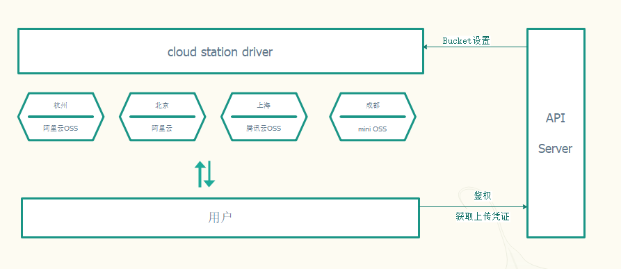
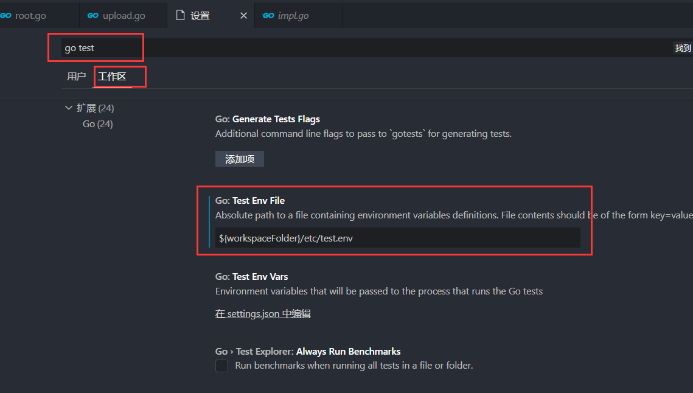
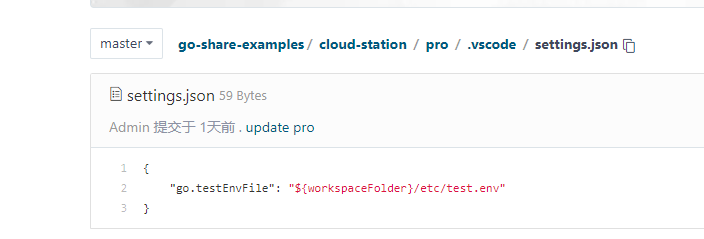
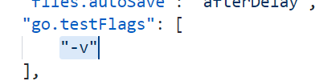

# 系统方式开发



+ 每个区域一个bucket, 用于内网访问加速
+ API server控制用户是否可以上传和下载
+ API server保存oss ak 和 sk, 避免泄露风险
+ 和其他系统集成

因此我们需要开发的系统组件有:
+ 客户端工具(CLI)
+ API Server控制器 (HTTP服务学习后实践)

不同于工具开发, 系统开发的思维访问 更偏向于系统设计与业务抽象, 基于系统模式我们来重构刚才的简单版

## 初始化工程: cloudstation

```go
go mod init gitee.com/infraboard/go-course/day8/cloudstation
```

## 客户端核心组件模块: store

### 抽象业务模型
为了屏蔽多个云厂商OSS操作的差异，我们抽象出一个store组件, 他用于解决 文件的上传和下载问题, 
因此我们为定义一个Uploader接口

```go
type Uploader interface {
	// 上传文件到后端存储
	UploadFile(bucketName, objectKey, localFilePath string) error
}
```

### 插件规划

如果想要作为cloud station的存储插件，就必须实现这个uploader接口, 我们有多少种插件
+ 腾讯云: qcloud
+ 阿里云: aliyun
+ 自己搭建的oss: mini

我们创建一个文件夹来存储我们即将开发的插件
```
$ ls provider/
aliyun  mini  qclouds
```

### 阿里云插件开发(初识TDD)

#### 编写插件骨架

迁移我们之前开发阿里云的上传函数为一个插件实现: provider/aliyun/store.go

插件作为uploader的一个实现方，必须实现uploader定义的函数, 因此我们定义对象来实现它

```go
// 构造函数
func NewUploader() store.Uploader {
	return &aliyun{}
}

type aliyun struct{}

func (p *aliyun) UploadFile(bucketName, objectKey, localFilePath string) error {
    return fmt.Errorf("not impl")
}
```
这样我们就实现了一个阿里云的uploader实例, 但是这个实例能不能正常工作喃? 对我们需要写测试用例,
也就是我们常说的DDD的开发流程


#### 配置测试用例运行环境

为了能不把我们测试用例使用的参数硬编码到代码里，可以有2个选择:
+ 单独加载测试用例使用的配置文件
+ 测试用例的配置通过环境变量配置

通常我们选用第二种, 因为简单直接, 那如何配置我们的vscode 在点击run测试用户的时候加载配置喃?

方法: 就是vsocde的Go 插件 在运行 go test的时候 支持环境变量注入? 



注意你配置文件的格式: 必须是 key=value, 比如
```
ALI_AK=xxx
ALI_SK=xxx
ALI_OSS_ENDPOINT=xxx
ALI_BUCKET_NAME=xxx
```

当然你也可以通过直接通过本项目的配置文件进行配置，在本项目的.vscode 下是本项目的vsocde配置, 其中 settings.json就是用配置的文件:


这样配置后, 当你点击 test或者 debug test的时候，测试用例就可以从你配置的文件中读取环境变量, 你们可以自行测试下

测试用例配置的问题解决完了，还有一个另外一个问题, 那就是默认情况下 我们在测试用例中使用print的时候 控制台是不打印 这些测试用例的中间环节信息的, 如果我们需要打印 就需要进行配置, 如何配置?

vscode 的 go插件在 执行测试用例的时候 是调用 go test 来执行的, 但是他没有加上 -v 参数, 因此我们通过vscode配置上该参数就可以了

注意这里配置的是vscode全局参数, 因此只需要配置一次，后面所有项目都可以生效


然后添加如下参数即可



然后可以进行简单的测试, 验证是否可以生效

```go
// TDD: 测试驱动开发
func TestUpload(t *testing.T) {
	fmt.Println("hello test detail log")
}
```

#### 为插件编写测试用例

编写实例的测试用例: provider/aliyun/store_test.go
```go
var (
	bucketName    = ""
	objectKey     = ""
	localFilePath = ""
)

func TestUploadFile(t *testing.T) {
	should := assert.New(t)

	uploader := aliyun.NewUploader()
	err := uploader.UploadFile(bucketName, objectKey, localFilePath)
	should.NoError(err)
}
```

我们尝试运行:
```
=== RUN   TestUploadFile
    e:\Projects\Golang\go-course\day8\cloudstation\store\provider\aliyun\store_test.go:21:
        	Error Trace:	store_test.go:21
        	Error:      	Received unexpected error:
        	            	not impl
        	Test:       	TestUploadFile
--- FAIL: TestUploadFile (0.00s)
FAIL
FAIL	gitee.com/infraboard/go-course/day8/cloudstation/store/provider/aliyun	0.045s
```

#### 完善插件逻辑, 直到测试用例通过

3.1 迁移主体函数

```go
// 构造函数
func NewUploader(endpoint, accessKey, secretKey string) store.Uploader {
	p := &aliyun{
		Endpoint:  endpoint,
		AccessKey:  accessKey,
		SecretKey: secretKey,
	}

	return p
}

type aliyun struct {
	Endpoint  string 
	AccessKey  string 
	SecretKey string 
}

func (p *aliyun) UploadFile(bucketName, objectKey, localFilePath string) error {
	bucket, err := p.GetBucket(bucketName)
	if err != nil {
		return err
	}

	err = bucket.PutObjectFromFile(objectKey, localFilePath)
	if err != nil {
		return fmt.Errorf("upload file to bucket: %s error, %s", bucketName, err)
	}
	signedURL, err := bucket.SignURL(objectKey, oss.HTTPGet, 60*60*24)
	if err != nil {
		return fmt.Errorf("SignURL error, %s", err)
	}
	fmt.Printf("下载链接: %s\n", signedURL)
	fmt.Println("\n注意: 文件下载有效期为1天, 中转站保存时间为3天, 请及时下载")
	return nil
}

func (p *aliyun) GetBucket(bucketName string) (*oss.Bucket, error) {
	if bucketName == "" {
		return nil, fmt.Errorf("upload bucket name required")
	}

	// New client
	client, err := oss.New(p.Endpoint, p.AccessKey, p.SecretKey)
	if err != nil {
		return nil, err
	}
	// Get bucket
	bucket, err := client.Bucket(bucketName)
	if err != nil {
		return nil, err
	}
	return bucket, nil
}
```

3.2 现在迁移参数校验逻辑

之前手动编写的校验函数，其实有个不错的第三库，可以帮我们完成校验: github.com/go-playground/validator

我们改造下我们的struct:
```go
type aliyun struct {
	Endpoint  string `validate:"required"`
	AccessKey  string `validate:"required"`
	SecretKey string `validate:"required"`
}
```

然后为我们实体编写校验逻辑
```go
// use a single instance of Validate, it caches struct info
var (
	validate = validator.New()
)

func (p *aliyun) validate() error {
	return validate.Struct(p)
}
```

最后再New构建实体的时候执行参数校验
```go
// 构造函数
func NewUploader(endpoint, accessKey, secretKey string) (store.Uploader, error) {
	p := &aliyun{
		Endpoint:  endpoint,
		AccessKey:  accessKey,
		SecretKey: secretKey,
	}

	if err := p.validate(); err != nil {
		return nil, err
	}

	return p, nil
}
```

修正我们的测试用例
```go
func TestUploadFile(t *testing.T) {
	should := assert.New(t)

	uploader, err := aliyun.NewUploader("", "", "")
	if should.NoError(err) {
		err = uploader.UploadFile(bucketName, objectKey, localFilePath)
		should.NoError(err)
	}
}
```

再次测试 我们的验证逻辑已经生效
```
=== RUN   TestUploadFile
    e:\Projects\Golang\go-course\day8\cloudstation\store\provider\aliyun\store_test.go:20:
        	Error Trace:	store_test.go:20
        	Error:      	Received unexpected error:
        	            	Key: 'aliyun.Endpoint' Error:Field validation for 'Endpoint' failed on the 'required' tag
        	            	Key: 'aliyun.AccessKey' Error:Field validation for 'AccessKey' failed on the 'required' tag
        	            	Key: 'aliyun.SecretKey' Error:Field validation for 'SecretKey' failed on the 'required' tag
        	Test:       	TestUploadFile
--- FAIL: TestUploadFile (0.00s)
FAIL
FAIL	gitee.com/infraboard/go-course/day8/cloudstation/store/provider/aliyun	0.251s
```

然后我们调整参数, 由于Endpoint 是一个URL, 不是非空就可的， 我们可以添加Endpoint的URL校验, 比如
```go
type aliyun struct {
	Endpoint  string `validate:"required,url"`
	AccessKey  string `validate:"required"`
	SecretKey string `validate:"required"`
}
```

最后我们测试用例如下:
```go
var (
	bucketName    = "cloud-station"
	objectKey     = "store.go"
	localFilePath = "store.go"

	endpoint = "http://oss-cn-chengdu.aliyuncs.com"
	ak       = os.Getenv("ALI_AK")
	sk       = os.Getenv("ALI_SK")
)

func TestUploadFile(t *testing.T) {
	should := assert.New(t)

	uploader, err := aliyun.NewUploader(endpoint, ak, sk)
	if should.NoError(err) {
		err = uploader.UploadFile(bucketName, objectKey, localFilePath)
		should.NoError(err)
	}
}
```

3.3 测试用例的debug调试

如果出现难以理解的调试结果， 你就需要debug了, vscode 测试用例的debug很简单, 总共2步就可以开启debug调试

+ 添加断点, 断点处必须有代码
+ 点击测试用例上方的 debug test文字

这是解决疑难杂症的利器，一定要会

到此 我们的aliyun的uploader插件就开发完成, 并且有一个基本的测试用例保证其质量

## 客户端用户接口CLI

我们要把程序 交付给用户使用，需要为其提供交互接口, 交互的方式有很多,  API, CLI, GUI, 现在我们为CLI交付

简单版本中，我们直接使用flag, 简单场景下已经足够我们使用了, 如果我们有很多命令，flag
用起来就由很多工作了, 比如docker的cli
```
$ docker 

Usage:  docker [OPTIONS] COMMAND

A self-sufficient runtime for containers

Management Commands:
  app*        Docker App (Docker Inc., v0.9.1-beta3)
  builder     Manage builds
  buildx*     Build with BuildKit (Docker Inc., v0.5.1-docker)
  compose*    Docker Compose (Docker Inc., 2.0.0-beta.1)
  config      Manage Docker configs
  container   Manage containers
  context     Manage contexts
  image       Manage images
  manifest    Manage Docker image manifests and manifest lists
  network     Manage networks
  node        Manage Swarm nodes
  plugin      Manage plugins
  scan*       Docker Scan (Docker Inc., v0.8.0)
  secret      Manage Docker secrets
  service     Manage services
  stack       Manage Docker stacks
  swarm       Manage Swarm
  system      Manage Docker
  trust       Manage trust on Docker images
  volume      Manage volumes
```

重构版 我们使用 github.com/spf13/cobra 作为我们的cli框架

### 添加root命令, 打印使用说明

```go
package cmd

import (
	"errors"
	"fmt"
	"os"

	"github.com/spf13/cobra"
)

var (
	vers         bool
	ossProvider  string
	aliAccessKey  string
	aliSecretKey string
)

// RootCmd represents the base command when called without any subcommands
var RootCmd = &cobra.Command{
	Use:   "cloud-station-cli",
	Short: "cloud-station-cli 文件中转服务",
	Long:  `cloud-station-cli ...`,
	RunE: func(cmd *cobra.Command, args []string) error {
		if vers {
			fmt.Println("0.0.1")
			return nil
		}
		return errors.New("no flags find")
	},
}

// Execute adds all child commands to the root command sets flags appropriately.
// This is called by main.main(). It only needs to happen once to the rootCmd.
func Execute() {
	if err := RootCmd.Execute(); err != nil {
		fmt.Println(err)
		os.Exit(-1)
	}
}

func init() {
	RootCmd.PersistentFlags().StringVarP(&ossProvider, "oss_provider", "p", "aliyun", "the oss provider [aliyun/qcloud]")
	RootCmd.PersistentFlags().StringVarP(&aliAccessKey, "ali_access_id", "i", "", "the ali oss access id")
	RootCmd.PersistentFlags().StringVarP(&aliSecretKey, "ali_secret_key", "k", "", "the ali oss access key")
	RootCmd.PersistentFlags().BoolVarP(&vers, "version", "v", false, "the cloud-station-cli version")
}
```

验证下效果
```
$ go run cmd/client/main.go 
Error: no flags find
Usage:
  cloud-station-cli [flags]

Flags:
  -i, --ali_access_id string    the ali oss access id
  -k, --ali_secret_key string   the ali oss access key
  -h, --help                    help for cloud-station-cli
  -p, --oss_provider string     the oss provider [aliyun/qcloud] (default "aliyun")
  -v, --version                 the cloud-station-cli version

no flags find
exit status 4294967295
```

### 添加upload命令

```go
package cmd

import (
	"fmt"
	"path"
	"time"

	"github.com/spf13/cobra"

	"gitee.com/infraboard/go-course/day8/cloudstation/store"
	"gitee.com/infraboard/go-course/day8/cloudstation/store/provider/aliyun"
)

const (
	// BuckName todo
	defaultBuckName = ""
	defaultEndpoint = ""
	defaultALIAK    = ""
	defaultALISK    = ""
)

var (
	buckName       string
	uploadFilePath string
	bucketEndpoint string
)

// uploadCmd represents the start command
var uploadCmd = &cobra.Command{
	Use:   "upload",
	Short: "上传文件到中转站",
	Long:  `上传文件到中转站`,
	RunE: func(cmd *cobra.Command, args []string) error {
		p, err := getProvider()
		if err != nil {
			return err
		}
		if uploadFilePath == "" {
			return fmt.Errorf("upload file path is missing")
		}

		// 为了防止文件都堆在一个文件夹里面 无法查看
		// 我们采用日期进行编码
		day := time.Now().Format("20060102")

		// 为了防止不同用户同一时间上传相同的文件
		// 我们采用用户的主机名作为前置
		hn, err := os.Hostname()
		if err != nil {
			ipAddr := getOutBindIp()
			if ipAddr == "" {
				hn = "unknown"
			} else {
				hn = ipAddr
			}
		}

		fn := path.Base(uploadFilePath)
		ok := fmt.Sprintf("%s/%s/%s", day, hn, fn)
		err = p.UploadFile(buckName, ok, uploadFilePath)
		if err != nil {
			return err
		}
		return nil
	},
}

func getOutBindIp() string {
	conn, err := net.Dial("udp", "baidu.com:80")
	if err != nil {
		return ""
	}
	defer conn.Close()

	addr := strings.Split(conn.LocalAddr().String(), ":")
	if len(addr) == 0 {
		return ""
	}

	return addr[0]
}

func getProvider() (p store.Uploader, err error) {
	switch ossProvider {
	case "aliyun":
		fmt.Printf("上传云商: 阿里云[%s]\n", defaultEndpoint)
		if aliAccessKey == "" {
			aliAccessKey = defaultALIAK
		}
		if aliSecretKey == "" {
			aliSecretKey = defaultALISK
		}
		fmt.Printf("上传用户: %s\n", aliAccessKey)
		p, err = aliyun.NewUploader(bucketEndpoint, aliAccessKey, aliSecretKey)
		return
	case "qcloud":
		return nil, fmt.Errorf("not impl")
	default:
		return nil, fmt.Errorf("unknown oss privier options [aliyun/qcloud]")
	}
}

func init() {
	uploadCmd.PersistentFlags().StringVarP(&uploadFilePath, "file_path", "f", "", "upload file path")
	uploadCmd.PersistentFlags().StringVarP(&buckName, "bucket_name", "b", defaultBuckName, "upload oss bucket name")
	uploadCmd.PersistentFlags().StringVarP(&bucketEndpoint, "bucket_endpoint", "e", defaultEndpoint, "upload oss endpoint")
	RootCmd.AddCommand(uploadCmd)
}
```

我们看下当前cli
```
$ go run cmd/client/main.go upload -h
上传文件到中转站

Usage:
  cloud-station-cli upload [flags]

Flags:
  -e, --bucket_endpoint string   upload oss endpoint
  -b, --bucket_name string       upload oss bucket name
  -f, --file_path string         upload file path
  -h, --help                     help for upload

Global Flags:
  -i, --ali_access_id string    the ali oss access id
  -k, --ali_secret_key string   the ali oss access key
  -p, --oss_provider string     the oss provider [aliyun/qcloud] (default "aliyun")
  -v, --version                 the cloud-station-cli version
```

### 验证cli

程序给了一下默认配置, 当然你可以设置成cli的默认值
```go
const (
	// BuckName todo
	defaultBuckName = "cloud-station"
	defaultEndpoint = "http://oss-cn-chengdu.aliyuncs.com"
	defaultALIAK    = "LTAI5tMvG5NA51eiH3ENZDaa"
	defaultALISK    = ""
)
```

然后验证
```
$ go run cmd/client/main.go upload -f go.mod  -k xxxx
上传云商: 阿里云[http://oss-cn-chengdu.aliyuncs.com]
上传用户: LTAI5tMvG5NA51eiH3ENZDaa
下载链接: http://cloud-station.oss-cn-chengdu.aliyuncs.com/20210724%2Fgo.mod?Expires=1627207783&OSSSecretKeyId=LTAI5tMvG5NA51eiH3ENZDaa&Signature=wq%2F%2BWKalz11w3RCWfR1Q6A6p40k%3D

注意: 文件下载有效期为1天, 中转站保存时间为3天, 请及时下载
```

到此我们基本实现了之前简单版本的功能, 但是扩展性要远远大于之前的简单版本

但是现在还存在如下2个问题:

+ access key 这种敏感数据 直接通过参数传入有安全风险, 需要改进
+ 我们的上传需要补充进度条

### 改进一: 敏感信息用户输入

简单的做法是直接使用fmt的scan函数从标准输出获取用户输入:
```go
func getSecretKeyFromInput() {
	fmt.Printf("请输入access key: ")
	fmt.Scanln(&aliSecretKey)
}
```

然后在uploader初始化的时候从终端读取:
```go
func getProvider() (p store.Uploader, err error) {
	...
	fmt.Printf("上传用户: %s\n", aliAccessKey)
	getSecretKeyFromInput()
	p, err = aliyun.NewUploader(bucketEndpoint, aliAccessKey, aliSecretKey)
	...
}
```

我了防止密码被别人窥见到, 我们可以使用一个第三方库来加密我们的输入: https://github.com/AlecAivazis/survey

```go
func getSecretKeyFromInputV2() {
	prompt := &survey.Password{
		Message: "请输入access key: ",
	}
	survey.AskOne(prompt, &aliSecretKey)
}
```

这样ak在终端输入的时候就相对安全了, 当然这个库还有很多不错的功能，对做漂亮的CLI交互来说，还是很不错的，有助于提升你工具的使用体验

### 改进二: 添加进度条

要现在做进度条，我们需要在上传的时候，获取当前上传进度，比如当前发送了多少个bytes的数据, 然后根据当前文件的大小 就可以计算出 当前的一个上传进度.

#### 分析sdk是否可以获取上传中的进度相关信息

但是我们用得sdk, 这个就得看sdk有没有给我们留口子
```go
func (bucket Bucket) PutObjectFromFile(objectKey, filePath string, options ...Option) error 
```

我们搜索支持的Option 可以找到Progress的选项
```go
// Progress set progress listener
func Progress(listener ProgressListener) Option {
	return addArg(progressListener, listener)
}
```

通过查看ProgressListener的定义，我们可以知道，我们可以提供一个lister在上传文件的时候, 他会把上传过程中的事件给我们
```go
// ProgressListener listens progress change
type ProgressListener interface {
	ProgressChanged(event *ProgressEvent)
}
```

我们可以看看能通过这个事件获取到那些信息: 开始, 传输中, 传输完成, 传输失败, 总共需要上传的大小(TotalBytes), 这次event上传成功了多少数据(RwBytes)
```go
// ProgressEventType defines transfer progress event type
type ProgressEventType int

const (
	// TransferStartedEvent transfer started, set TotalBytes
	TransferStartedEvent ProgressEventType = 1 + iota
	// TransferDataEvent transfer data, set ConsumedBytes anmd TotalBytes
	TransferDataEvent
	// TransferCompletedEvent transfer completed
	TransferCompletedEvent
	// TransferFailedEvent transfer encounters an error
	TransferFailedEvent
)

// ProgressEvent defines progress event
type ProgressEvent struct {
	ConsumedBytes int64
	TotalBytes    int64
	RwBytes       int64
	EventType     ProgressEventType
}
```

#### 实现一个简易版的listner

有了这些数据，基本就够我们展示进度条时使用了.
接下来我们需要实现一个自己的lister, 用户接收事件, 先简单打印下: provider/aliyun/listener
```go
import (
	"fmt"

	"github.com/aliyun/aliyun-oss-go-sdk/oss"
)

// NewOssProgressListener todo
func NewOssProgressListener(fileName string) *OssProgressListener {
	return &OssProgressListener{}
}

// OssProgressListener is the progress listener
type OssProgressListener struct {
}

// ProgressChanged todo
func (p *OssProgressListener) ProgressChanged(event *oss.ProgressEvent) {
	fmt.Println(event.EventType, event.TotalBytes, event.RwBytes)
}
```

然后我们把listner作为uploader的一个实例属性, 实例初始化时直接生成, 在上传的时候传递过去
```go
// 构造函数
func NewUploader(endpoint, accessKey, secretKey string) (store.Uploader, error) {
	p := &aliyun{
		...
		listner: NewOssProgressListener(),
	}
}

type aliyun struct {
	...
	listner oss.ProgressListener
}

func (p *aliyun) UploadFile(bucketName, objectKey, localFilePath string) error {
	...
	err = bucket.PutObjectFromFile(objectKey, localFilePath, oss.Progress(p.listner))
	...
}
```

接下来继续我的测试用例:
```
=== RUN   TestUploadFile
1 1918 0
2 1918 1918
3 1918 0
...
```

#### 找个进度条ui展示出来

比如我们要实现一个这样的进度条, 大家觉得容易不
```
[==>             ] 30%
```
还是要费点功夫的，核心逻辑是: 通过退格键(\b)删除后重新渲染，视觉上看起来好像中间的部分在挪动一样

这里我们选择一个第三方库：github.com/schollz/progressbar
我们看下他样例
```go
bar := progressbar.Default(100)
for i := 0; i < 100; i++ {
    bar.Add(1)
    time.Sleep(40 * time.Millisecond)
}
```

可以看到核心是通过Add来控制进度, 因此我们把需要上传的文件总大小当做total, 然后把每次上传了多个byte Add给bar就可以了


```go
// ProgressChanged todo
func (p *OssProgressListener) ProgressChanged(event *oss.ProgressEvent) {
	switch event.EventType {
	case oss.TransferStartedEvent:
		p.bar = progressbar.DefaultBytes(
			event.TotalBytes,
			"文件上传中",
		)
	case oss.TransferDataEvent:
		p.bar.Add64(event.RwBytes)
	case oss.TransferCompletedEvent:
		fmt.Printf("\n上传完成\n")
	case oss.TransferFailedEvent:
		fmt.Printf("\n上传失败\n")
	default:
	}
}
```

我们测试下，看下效果:
```
文件上传中 100% |███████████████████████████| (1.9/1.9 kB, 86.513 kB/s)
```

当然你也可以优化下显示, 直接控制下显示的样式，比如
```go
// ProgressChanged todo
func (p *OssProgressListener) ProgressChanged(event *oss.ProgressEvent) {
	switch event.EventType {
	case oss.TransferStartedEvent:
		p.bar = progressbar.NewOptions64(event.TotalBytes,
			progressbar.OptionSetWriter(ansi.NewAnsiStdout()),
			progressbar.OptionEnableColorCodes(true),
			progressbar.OptionShowBytes(true),
			progressbar.OptionSetWidth(30),
			progressbar.OptionSetDescription("开始上传:"),
			progressbar.OptionSetTheme(progressbar.Theme{
				Saucer:        "=",
				SaucerHead:    ">",
				SaucerPadding: " ",
				BarStart:      "[",
				BarEnd:        "]",
			}),
		)
		p.startAt = time.Now()
		fmt.Printf("文件大小: %s\n", HumanBytesLoaded(event.TotalBytes))
	case oss.TransferDataEvent:
		p.bar.Add64(event.RwBytes)
	case oss.TransferCompletedEvent:
		fmt.Printf("\n上传完成: 耗时%d秒\n", int(time.Since(p.startAt).Seconds()))
	case oss.TransferFailedEvent:
		fmt.Printf("\n上传失败: \n")
	default:
	}
}
```

最后显示效果如下:
```
文件大小: 1.87KB
开始上传: 100% [==============================] (81.346 kB/s)
上传完成: 耗时0秒
...
```

## 总结

虽然我们没有实现API Server，但是我们把核心上传逻辑使用接口进行了解耦，也方便我们添加其他云的插件, 为后面扩展留下了良好的设计。虽然实现的功能大体相近，但是思维模式完全不一样, 这就是运维写出来的代码虽然能用，但那味就是有点不对的根本原因之一。

+ 面向对象思维模式
+ 合理组织你的项目结构
+ 如何使用接口解耦程序
+ 测试驱动开发TDD
+ 断点调试(debug)
+ CLI
+ 合理使用第三方库