# 互联网协议介绍


+ 直播服务: RMTP(TCP), HLS(HTTP), HTTP-FLV
+ 邮件服务: SMTP, POP3, IMAP
+ 微信,QQ: 自定义协议(基于TCP)
+ 物联网设备: 自定义协议(基于TCP)
+ 浏览器: HTTP/WebSocket
+ 其他应用(TCP上自定义, HTTP上自定义)

## 应用与协议

我们以熟悉的直播App的开发为例:

+ 直播原理：把主播录制的视频，推送到服务器，在由服务器分发给观众观看。
+ 直播环节：
    + 推流端: 采集、美颜处理、编码、推流
    + 服务端处理: 转码、录制、截图、鉴黄
    + 播放器: 拉流、解码、渲染
    + 互动系统: 聊天室、礼物系统、赞

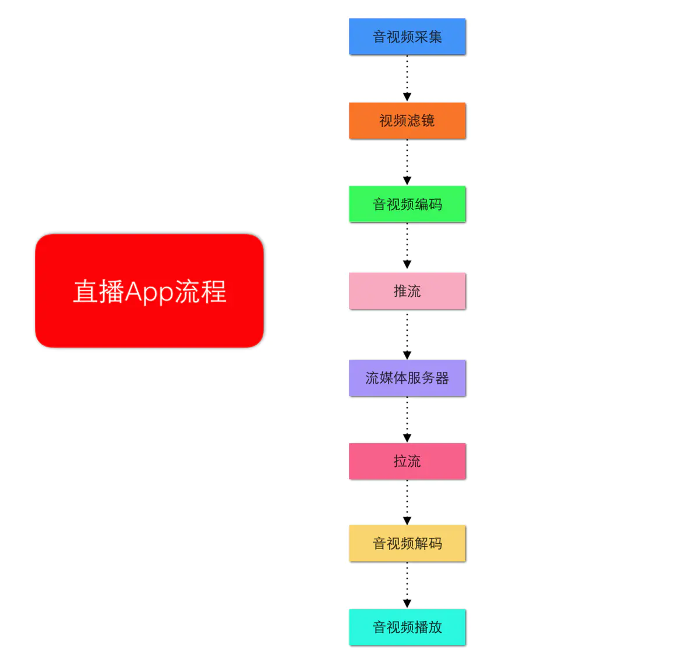

其中有很多是业务逻辑, 涉及到网络通信的部分有几处:
+ 客户端推流(主播端) --> 服务端
+ 客户端拉流(观众端) <-- 服务器

那我们的数据是如何在他们之间相互传输的喃? 如何把数据传输出去？这就需要先讲讲互联网分层模型

## 互联网分层模型

互联网的逻辑实现被分为好几层。每一层都有自己的功能，就像建筑物一样，每一层都靠下一层支持。用户接触到的只是最上面的那一层，根本不会感觉到下面的几层。要理解互联网就需要自下而上理解每一层的实现的功能

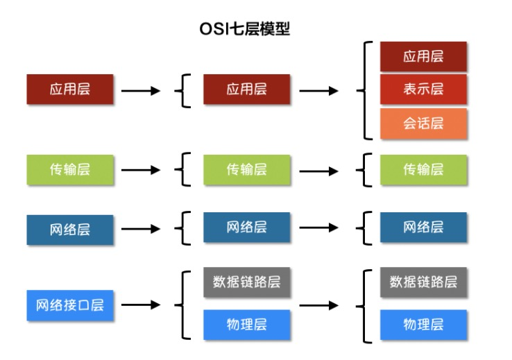

### 物理层

我们的电脑要与外界互联网通信，需要先把电脑连接网络，我们可以用双绞线、光纤、无线电波等方式。这就叫做”实物理层”，它就是把电脑连接起来的物理手段。它主要规定了网络的一些电气特性，作用是负责传送0和1的电信号

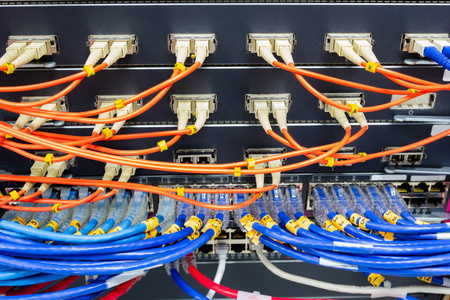

### 数据链路层

单纯的0和1没有任何意义，所以我们使用者会为其赋予一些特定的含义，规定解读电信号的方式：例如：多少个电信号算一组？每个信号位有何意义？这就是”数据链接层”的功能，它在”物理层”的上方，确定了物理层传输的0和1的分组方式及代表的意义。早期的时候，每家公司都有自己的电信号分组方式。逐渐地，一种叫做”以太网”（Ethernet）的协议，占据了主导地位

#### 帧的定义

以太网规定，一组电信号构成一个数据包，叫做”帧”（Frame）。每一帧分成两个部分:
+ 标头（Head）: 一些说明项，比如发送者、接受者、数据类型等等, ”标头”的长度，固定为18字节, 他们的一个重要作用就是帧定界
+ 数据（Data）: 数据包的具体内容, ”数据”的长度，最短为46字节，最长为1500字节(最大传送单元MTU Maximum Transfer Unit)

因此，整个”帧”最短为64字节，最长为1518字节。如果数据很长，就必须分割成多个帧进行发送

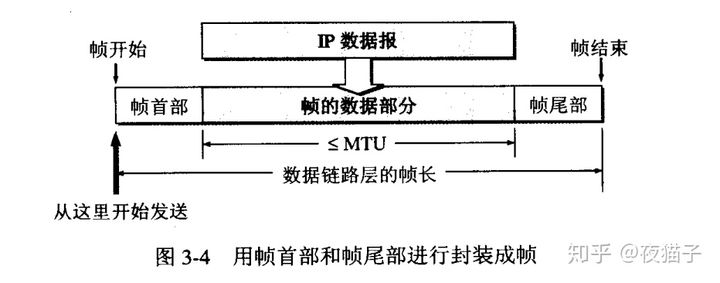

首部和尾部都提供很多重要的控制信息，他们的一个重要作用就是帧定界（确定帧的界限)

采用控制字符 标识帧的开始和结束:
+ SOH （Start Of Header）: 十六进制 编码是01 , 表示帧的首部开始
+ EOT （End Of Transmission）: 十六进制 编码是04, 表示帧的结束

如果被传输的数据中也出现了控制字符: 01/04, 这会导致我们在拆解Frame时出现混乱， 怎么办? 

+ ESC （escape)： 十六进制编码是 1B, 用于控制字符转义, 比如1B01 就是数据01, 而不是控制字符01

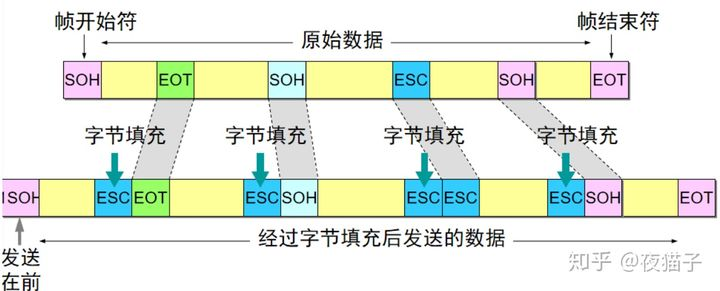

#### Mac地址(物理地址)

以太网规定，连入网络的所有设备都必须具有”网卡”接口。数据包必须是从一块网卡，传送到另一块网卡。网卡的地址，就是数据包的发送地址和接收地址，这叫做MAC地址

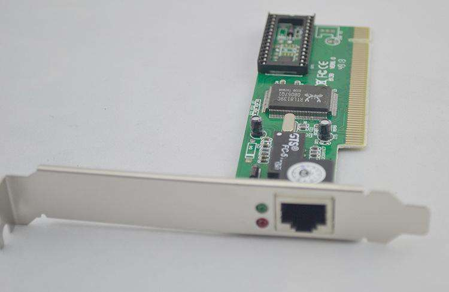

为了能够正确地将数据包发送出去，就必须要求 MAC 地址具有唯一性。因此 MAC 地址都是由生产厂家在生产时固化在网络硬件中，是硬件预留的地址

硬件的 MAC 地址是厂家按照一定的规则，进行设置所产生的，因此，MAC 地址拥有自己的格式

```
一共48位, 分成2段:

前 24 位 + 后 24 位
-------   --------
厂商标识   扩展标识符
```

+ OUI: 组织唯一标识符（Organizationally Unique Identifier，OUI），是由 IEEE 的注册管理机构给不同厂家分配的代码，区分了不同的厂家
+ NIC: 由厂家自己分配的，称为扩展标识符。同一个厂家生产的网卡中 MAC 地址后 24 位是不同的

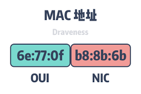

通过这个网站可以在线查询 [Mac地址厂商在线查询](http://mac.51240.com/)

有了MAC地址，就可以定位网卡和数据包的路径了, 但是如何才能知道网络中其他设备的Mac地址喃?

#### Mac寻址

有了MAC地址之后，如何把数据准确的发送给接收方呢？其实这里以太网采用了一种很”原始”的方式，它不是把数据包准确送到接收方，而是向本网络内所有计算机都发送，让每台计算机读取这个包的”标头”，找到接收方的MAC地址，然后与自身的MAC地址相比较，如果两者相同，就接受这个包，做进一步处理，否则就丢弃这个包.

像上面这种广播的寻找方式就是ARP寻址

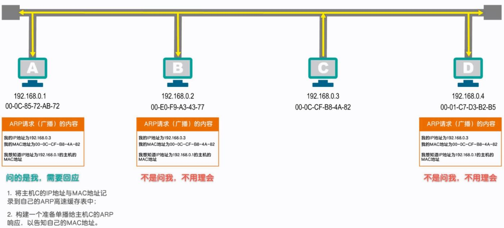


### 网络层

依靠MAC地址和物理链路, 就可以找到链路中的网络设备和他进行通信, 但是由于APR寻址的广播方式，注定MAC通信不适用于大规模网络环境

因此我们就需要将这些设备隔离在一个一个的区域, 但是各个区域之间应该如何通信, 这就导致了”网络层”的诞生

它的作用是引进一套新的地址，使得我们能够区分不同的计算机是否属于同一个网络, 并且知道如何找到其他网络。这套地址就叫做”网络地址”，简称”网址”

#### IP地址(网络地址)

规定网络地址的协议，叫做IP协议。它所定义的地址，就被称为IP地址。目前，广泛采用的是IP协议第四版，简称IPv4。IPv4这个版本规定，网络地址由32个二进制位组成，我们通常习惯用分成四段的十进制数表示IP地址，从0.0.0.0一直到255.255.255.255

IP地址由2部分构成:
+ 网络号, 也叫网段
+ 主机号, 在这个网段内的编号, 和网络号一起构成主机在网络中的唯一标识符

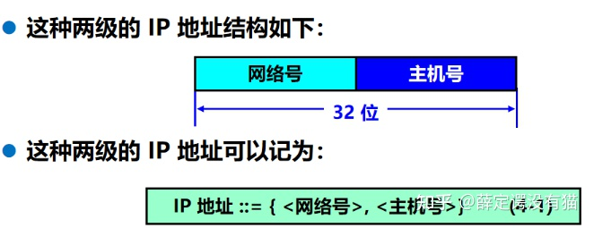

那我们如何划分网段喃?


IP地址分类：
```
1、A类IP地址
一个A类IP地址由1字节的网络地址和3字节主机地址组成，网络地址的最高位必须是“0”， 地址范围从1.0.0.0 到126.0.0.0。可用的A类网络有126个，每个网络能容纳1亿多个主机。  

2、B类IP地址
一个B类IP地址由2个字节的网络地址和2个字节的主机地址组成，网络地址的最高位必须是“10”，地址范围从128.0.0.0到191.255.255.255。可用的B类网络有16382个，每个网络能容纳6万多个主机 。

3、C类IP地址
一个C类IP地址由3字节的网络地址和1字节的主机地址组成，网络地址的最高位必须是“110”。范围从192.0.0.0到223.255.255.255。C类网络可达209万余个，每个网络能容纳254个主机。

4、D类地址
用于多点广播（Multicast）。 D类IP地址第一个字节以“lll0”开始，它是一个专门保留的地址。它并不指向特定的网络，目前这一类地址被用在多点广播（Multicast）中。多点广播地址用来一次寻址一组计算机，它标识共享同一协议的一组计算机。224.0.0.0到239.255.255.255用于多点广播 。

5、E类IP地址
以“llll0”开始，为将来使用保留。240.0.0.0到255.255.255.254，255.255.255.255用于广播地址，全零（“0．0．0．0”）地址对应于当前主机。全“1”的IP地址（“255．255．255．255”）是当前子网的广播地址。
```

在IP地址3种主要类型里，各保留了3个区域作为私有地址，其地址范围如下： 
+ A类地址：10.0.0.0～10.255.255.255 
+ B类地址：172.16.0.0～172.31.255.255 
+ C类地址：192.168.0.0～192.168.255.255

规划得不错, 那谁来管理这些地址的颁发? 毕竟这没有硬件，不能出场烧入

IP地址空间 是由互联网号码分配局（英语：Internet Assigned Numbers Authority，简称：IANA）以及其他5个区域互联网注册管理机构（英语：Regional Internet Registry，简称：RIR）在其指定区域内分配给本地Internet注册表

如何管理IP地址与网管:

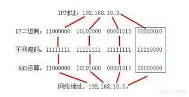

#### IP寻址

肯定不能再使用广播的寻找方式了? 这时候的网络太大了, 那么基于IP如何寻址

广播相当于轮询, 又没有O(1)的办法, 对通过查表(路由表)

IP寻址的核心 就是路由表:

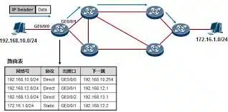


### 传输层


### 应用层


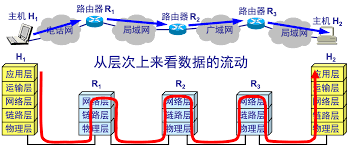


## socket编程

Socket是应用层与TCP/IP协议族通信的中间软件抽象层。在设计模式中，Socket其实就是一个门面模式，它把复杂的TCP/IP协议族隐藏在Socket后面，对用户来说只需要调用Socket规定的相关函数，让Socket去组织符合指定的协议数据然后进行通信


## 参考

+ [计算机网络之数据链路层基础详解](https://zhuanlan.zhihu.com/p/225668603)
+ [IP地址分类有哪些，IP地址的分类有什么区别](http://www.shartu.com/network/275.html)


