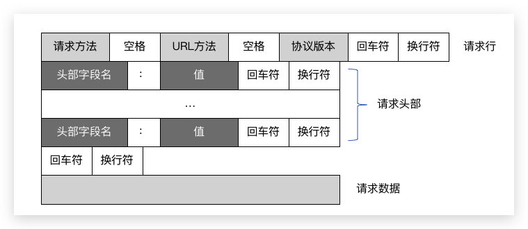
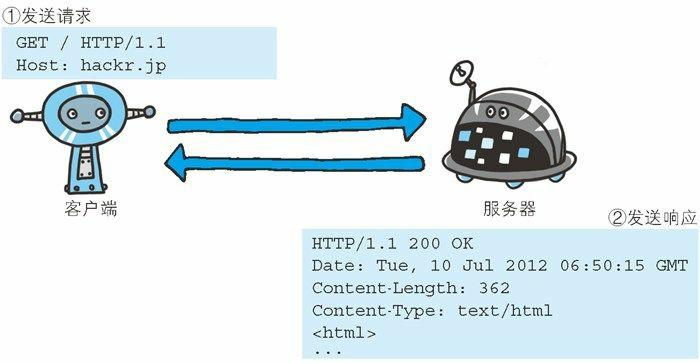
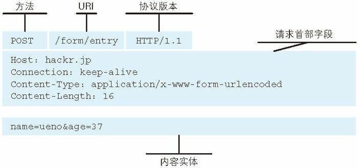
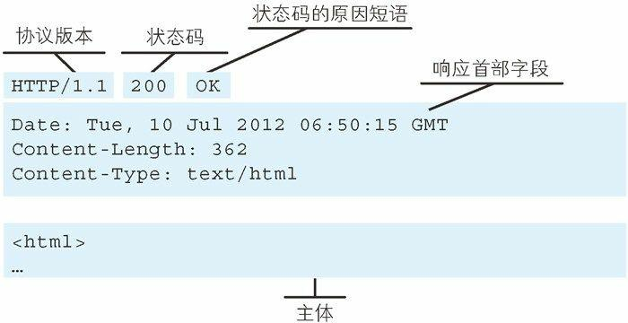

# HTTP 协议

HTTP是Hyper Text Transfer Protocol（超文本传输协议）的缩写。它的发展是万维网协会（World Wide Web Consortium）和Internet工作小组IETF（Internet Engineering Task Force）合作的结果，最终发布了一系列的RFC，RFC 1945定义了HTTP/1.0版本。其中最著名的就是RFC 2616。RFC 2616定义了今天普遍使用的一个版本–HTTP 1.1

下图是HTTP协议格式:



## 协议交互



## 请求报文

HTTP的请求分为：请求行、请求头和请求体。




### 请求方法

| 方法 | 描述 |
|  ----  | ----  |
|  GET | 请求指定的页面信息，并返回实体主体|
|  HEAD | 类似于GET请求，只不过返回的响应中没有具体的内容，用于获取报头|
|  POST | 向指定资源提交数据进行处理请求（例如提交表单或者上传文件）。数据被包含在请求体中。POST请求可能会导致新的资源的建立或已有资源的修改|
|  PUT | 从客户端向服务器传送的数据取代指定的文档的内容|
|  DELETE | 请求服务器删除指定的页面|
|  CONNECT | HTTP/1.1协议中预留给能够将连接改为管道方式的代理服务器。|
|  OPTIONS | 允许客户端查看服务器的性能|
|  TRACE | 回显服务器收到的请求，主要用于测试或诊断。|  

### 统一资源定位符: URI

URL由三部分组成：资源类型、存放资源的主机域名、资源文件名

```sh
protocol :// hostname[:port] / path / [?parameters]#fragment
```

比如: https://baijiahao.baidu.com/s?id=1603848351636567407&wfr=spider&for=pc

+ protocol：https
+ hostname：baijiahao.baidu.com
+ parameters：id=1603848351636567407&wfr=spider&for=pc （使用&分割参数）


### 协议版本

+ HTTP1.1
+ HTTP2
+ HTTP3


### 请求头

+ Accept：指定客户端能够接收的内容类型
+ Accept-Encoding：指定浏览器可以支持的web服务器返回内容压缩编码类型
+ Accept-Language：浏览器可接受的语言
+ Content-Length：请求的内容的长度，如：Content-Lenght：348
+ Content-Type：请求的与实体对应的MIME信息，常用的类型如下：
    + text/html：HTML格式
    + text/plain：纯文本格式
    + text/xml：XML格式
    + image/gif：gif图片格式
    + image/jpeg：jpg图片格式
    + image/png：png图片格式
    + application/xhtml+xml：XHTML格式
    + application/xml：XML数据格式
    + application/json：JSON数据格式
    + application/pdf：pdf格式
    + application/msword：word文档格式
    + application/octet-stream：二进制流数据
+ Date请求发送的日期和时间

更多的请求头字段参考：[HTTP响应头和请求头信息对照表](http://tools.jb51.net/table/http_header)

### 请求体

在整个报文中，请求头之后，隔一行空格，以下部分就是HTTP的请求体了。请求体是我们发送请求的时候需要传给接收端的内容。其格式需要和请求头中的Content-Type对应，不然会导致接受无法识别

## 响应报文

HTTP的响应同样分为：响应行、响应头和响应体。和请求报文有点类似




### 状态码

响应行中包含了HTTP的版本和本次请求的状态，状态码见[HTTP Status Code](https://datatracker.ietf.org/doc/html/rfc2616#section-6.1.1)

### 响应头

响应头用于描述服务器的基本信息、数据的描述，这些信息将告知客户端如何处理响应头中的内容。

+ Allow 服务器支持哪些请求方法（如GET、POST等）。
+ Content-Encoding 文档的编码（Encode）方法。只有在解码之后才能得到Content-Type头指定的内容类型。利用gzip压缩文档能够显著地减少HTML文档的下载时间。
+ Content-Lenght 表示内容长度。只有当浏览器使用持久HTTP连接时才需要这个数据。
+ Content-Type 表示后面的文档属于什么MIME类型。更多的请求头字段参考：[HTTP响应头和请求头信息对照表](http://tools.jb51.net/table/http_header)

### 响应实体

响应实体中包含的就是客户端从服务器中获取的数据了。数据的格式和长度都会在响应体中描述


## 实战验证

基于标准库写个简单的http 接口服务

```go
package main

import (
	"fmt"
	"net/http"
)

func IndexHandler(w http.ResponseWriter, r *http.Request) {
	fmt.Fprintln(w, "hello, world")
}

func main() {
	http.HandleFunc("/", IndexHandler)
	http.ListenAndServe(":8080", nil)
}
```

启动后使用telent来进行验证
```sh
$telnet localhost 8080
Trying ::1...
Connected to localhost.
Escape character is '^]'.
GET / HTTP/1.1
HOST:localhost

HTTP/1.1 200 OK
Date: Sun, 29 Aug 2021 05:58:49 GMT
Content-Length: 13
Content-Type: text/plain; charset=utf-8

hello, world
```

## 参考

+ [rfc2616](https://datatracker.ietf.org/doc/html/rfc2616)
