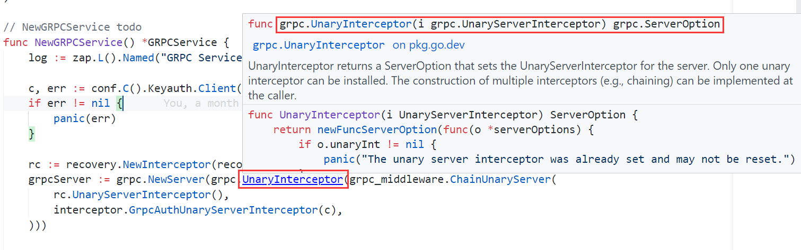
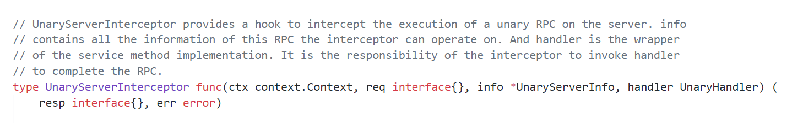
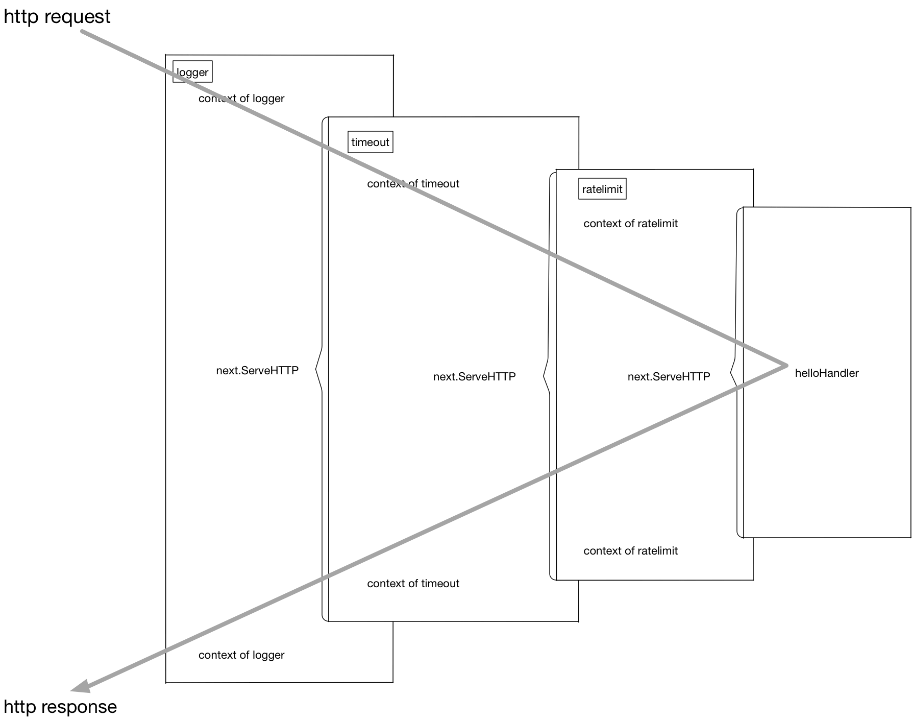
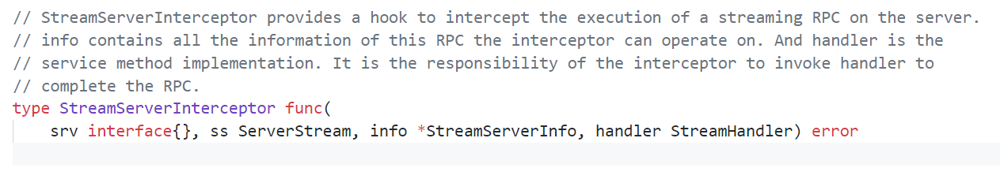
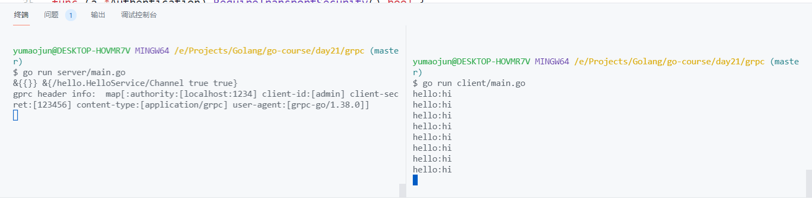

# GRPC 入门


gRPC是Google公司基于Protobuf开发的跨语言的开源RPC框架。gRPC基于HTTP/2协议设计，可以基于一个HTTP/2链接提供多个服务，对于移动设备更加友好。本节将讲述gRPC的简单用法

这个是我们之前定义的接口
```go
package service

const HelloServiceName = "HelloService"

type HelloService interface {
	Hello(*Request, *Response) error
}
```

其中数据结构: Request和Response 已经使用protobuf定义了数据的交换格式,  如果我们的接口也能通过 protobuf定义是不是 就完美了, 这也是GRPC真正的威力


## GRPC技术栈


+ 数据交互格式: protobuf
+ 通信方式: 最底层为TCP或Unix Socket协议，在此之上是HTTP/2协议的实现
+ 核心库: 在HTTP/2协议之上又构建了针对Go语言的gRPC核心库
+ Stub: 应用程序通过gRPC插件生产的Stub代码和gRPC核心库通信，也可以直接和gRPC核心库通信

gRPC采用protobuf描述 接口和数据, 我们可以把他理解为: protobuf ON HTTP2 的一种RPC


## Hello gRPC

下面我们讲演示一个基础的gRPC服务.

### protobuf grpc插件

protobuf 不仅可以定义交互的数据结构(message), 还可以定义交互的接口:

```protobuf
service HelloService {
    rpc Hello (String) returns (String);
}
```

从Protobuf的角度看，gRPC只不过是一个针对service接口生成代码的生成器。因此我们需要提前安装grpc的代码生成插件

```sh
# protoc-gen-go 插件之前已经安装
# go install google.golang.org/protobuf/cmd/protoc-gen-go@latest

# 安装protoc-gen-go-grpc插件
go install google.golang.org/grpc/cmd/protoc-gen-go-grpc@latest
```

我们看一看到当前插件的版本
```sh
protoc-gen-go-grpc --version                                   
protoc-gen-go-grpc 1.1.0
```

### 生成代码

然后基于protoc-gen-go-grpc来生产我们的grpc代码, 我们把之前的rpc 修改为GRPC

我们看看protobuf 定义接口的语法:
```protobuf
service <service_name> {
    rpc <function_name> (<request>) returns (<response>);
}
```
+ service: 用于申明这是个服务的接口
+ service_name: 服务的名称,接口名称
+ function_name: 函数的名称
+ request: 函数参数， 必须的
+ response: 函数返回， 必须的, 不能没有

```protobuf
syntax = "proto3";

package hello;
option go_package="gitee.com/infraboard/go-course/day21/pbrpc/service";

// The HelloService service definition.
service HelloService {
    rpc Hello (Request) returns (Response);
}

message Request {
    string value = 1;
}

message Response {
    string value = 1;
}
```

然后我们生产代码, 同时制定gprc插件对应参数:
```sh
protoc -I=. --go_out=./grpc/service --go_opt=module="gitee.com/infraboard/go-course/day21/grpc/service" \
--go-grpc_out=./grpc/service --go-grpc_opt=module="gitee.com/infraboard/go-course/day21/grpc/service" \
grpc/service/service.proto
```

生成代码: 
```go
// 客户端
// HelloServiceClient is the client API for HelloService service.
//
// For semantics around ctx use and closing/ending streaming RPCs, please refer to https://pkg.go.dev/google.golang.org/grpc/?tab=doc#ClientConn.NewStream.
type HelloServiceClient interface {
	Hello(ctx context.Context, in *Request, opts ...grpc.CallOption) (*Response, error)
}

// 服务端
// HelloServiceServer is the server API for HelloService service.
// All implementations must embed UnimplementedHelloServiceServer
// for forward compatibility
type HelloServiceServer interface {
	Hello(context.Context, *Request) (*Response, error)
	mustEmbedUnimplementedHelloServiceServer()
}
```

### gRPC服务端

基于服务端的HelloServiceServer接口可以重新实现HelloService服务

首先我们构建一个服务实体，实现GRPC定义的接口
```go
package main

import (
	"context"
	"log"
	"net"

	"gitee.com/infraboard/go-course/day21/grpc/service"
	"google.golang.org/grpc"
)

var _ service.HelloServiceServer = (*HelloService)(nil)

type HelloService struct {
	service.UnimplementedHelloServiceServer
}

func (p *HelloService) Hello(ctx context.Context, req *service.Request) (*service.Response, error) {
	resp := &service.Response{}
	resp.Value = "hello:" + req.Value
	return resp, nil
}
```

最后依赖grpc API 启动gRPC服务端:
```go
func main() {
	// 首先是通过grpc.NewServer()构造一个gRPC服务对象
	grpcServer := grpc.NewServer()
	// 然后通过gRPC插件生成的RegisterHelloServiceServer函数注册我们实现的HelloServiceImpl服务
	service.RegisterHelloServiceServer(grpcServer, new(HelloService))

	lis, err := net.Listen("tcp", ":1234")
	if err != nil {
		log.Fatal(err)
	}

	// 然后通过grpcServer.Serve(lis)在一个监听端口上提供gRPC服务
	grpcServer.Serve(lis)
}
```

### gRPC客户端

```go
package main

import (
	"context"
	"fmt"
	"log"

	"gitee.com/infraboard/go-course/day21/grpc/service"
	"google.golang.org/grpc"
)

func main() {
    // grpc.Dial负责和gRPC服务建立链接
	conn, err := grpc.Dial("localhost:1234", grpc.WithInsecure())
	if err != nil {
		log.Fatal(err)
	}
	defer conn.Close()

    // NewHelloServiceClient函数基于已经建立的链接构造HelloServiceClient对象,
    // 返回的client其实是一个HelloServiceClient接口对象
	client := service.NewHelloServiceClient(conn)


    // 通过接口定义的方法就可以调用服务端对应的gRPC服务提供的方法
	req := &service.Request{Value: "hello"}
	reply, err := client.Hello(context.Background(), req)
	if err != nil {
		log.Fatal(err)
	}
	fmt.Println(reply.GetValue())
}
```

##  gRPC流

RPC是远程函数调用，因此每次调用的函数参数和返回值不能太大，否则将严重影响每次调用的响应时间。因此传统的RPC方法调用对于上传和下载较大数据量场景并不适合。为此，gRPC框架针对服务器端和客户端分别提供了流特性

服务端或客户端的单向流是双向流的特例，我们在HelloService增加一个支持双向流的Channel方法
```protobuf
// The HelloService service definition.
service HelloService {
    rpc Hello (Request) returns (Response) {}

	rpc Channel (stream Request) returns (stream Response) {}
}
```

关键字stream指定启用流特性，参数部分是接收客户端参数的流，返回值是返回给客户端的流。

所以 定义streaming RPC 的语法如下:
```
rpc <function_name> (stream <type>) returns (stream <type>) {}
```


### 生成Streaming RPC

然后我们重新生成RPC代码
```sh
protoc -I=. --go_out=./grpc/service --go_opt=module="gitee.com/infraboard/go-course/day21/grpc/service" --go-grpc_out=./grpc/service --go-grraboard/go-course/day21/grpc/service" \
grpc/service/service.proto
```

我们看看接口的变化: 
```go
// 客户端的Channel方法返回一个HelloService_ChannelClient类型的返回值，可以用于和服务端进行双向通信
// HelloServiceClient is the client API for HelloService service.
//
// For semantics around ctx use and closing/ending streaming RPCs, please refer to https://pkg.go.dev/google.golang.org/grpc/?tab=doc#ClientConn.NewStream.
type HelloServiceClient interface {
	Hello(ctx context.Context, in *Request, opts ...grpc.CallOption) (*Response, error)
	Channel(ctx context.Context, opts ...grpc.CallOption) (HelloService_ChannelClient, error)
}


// 在服务端的Channel方法参数是一个新的HelloService_ChannelServer类型的参数，可以用于和客户端双向通信
// HelloServiceServer is the server API for HelloService service.
// All implementations must embed UnimplementedHelloServiceServer
// for forward compatibility
type HelloServiceServer interface {
	Hello(context.Context, *Request) (*Response, error)
	Channel(HelloService_ChannelServer) error
	mustEmbedUnimplementedHelloServiceServer()
}
```

HelloService_ChannelClient 和 HelloService_ChannelServer 接口定义:
```go
// Request  -----> 
// Response <----
type HelloService_ChannelClient interface {
	Send(*Request) error
	Recv() (*Response, error)
	grpc.ClientStream
}

// Request <----
// Reponse ---->
type HelloService_ChannelServer interface {
	Send(*Response) error
	Recv() (*Request, error)
	grpc.ServerStream
}
```

可以发现服务端和客户端的流辅助接口均定义了Send和Recv方法用于流数据的双向通信

### 服务端

server端逻辑:
+ 接收一个Request
+ 响应一个Response

```go
func (p *HelloService) Channel(stream service.HelloService_ChannelServer) error {
	// 服务端在循环中接收客户端发来的数据
	for {
		// 接收一个请求
		args, err := stream.Recv()
		if err != nil {
			// 如果遇到io.EOF表示客户端流被关闭
			if err == io.EOF {
				return nil
			}
			return err
		}

		// 响应一个请求
		// 生成返回的数据通过流发送给客户端
		resp := &service.Response{Value: "hello:" + args.GetValue()}
		err = stream.Send(resp)
		if err != nil {
			// 服务端发送异常, 函数退出, 服务端流关闭
			return err
		}
	}
}
```

双向流数据的发送和接收都是完全独立的行为。

需要注意的是，发送和接收的操作并不需要一一对应，用户可以根据真实场景进行组织代码

### 客户端

```go
package main

import (
	"context"
	"fmt"
	"io"
	"log"
	"time"

	"gitee.com/infraboard/go-course/day21/grpc/service"
	"google.golang.org/grpc"
)

func main() {
	conn, err := grpc.Dial("localhost:1234", grpc.WithInsecure())
	if err != nil {
		log.Fatal(err)
	}
	defer conn.Close()

	client := service.NewHelloServiceClient(conn)

	// 客户端需要先调用Channel方法获取返回的流对象
	stream, err := client.Channel(context.Background())
	if err != nil {
		log.Fatal(err)
	}

	// 在客户端我们将发送和接收操作放到两个独立的Goroutine。

	// 首先是向服务端发送数据
	go func() {
		for {
			if err := stream.Send(&service.Request{Value: "hi"}); err != nil {
				log.Fatal(err)
			}
			time.Sleep(time.Second)
		}
	}()

	// 然后在循环中接收服务端返回的数据
	for {
		reply, err := stream.Recv()
		if err != nil {
			if err == io.EOF {
				break
			}
			log.Fatal(err)
		}
		fmt.Println(reply.GetValue())
	}
}
```

## gRPC认证

前面我们的grpc服务 在无任何保护机制下 都可以被任何人调用, 这是很危险的, 因此我们需要为grpc 添加认证的功能

我们在上面的流程中可以得知Grpc有2种模式:
+ Request Response模式
+ Stream 模式

在grpc的认证体系中, 着2种认证是独立开的，大家可以思考下为什么?

### Request Response认证

我们先来看看 grpc框架给我们预留的 拦截器钩子:



#### 原理

我们可以来详细看看, 这个拦截器给我们提供哪些信息




+ ctx 请求上下文
+ req rpc请求数据
+ info 服务端相关数据, 不用理解这个
+ handler 处理请求的handler, 相对于next()
+ resp rpc响应
+ err rpc 错误

gprc 基于HTTP2通讯, grpc的拦截器的作用原理和 http的中间件是一样的:



#### 编写中间件

基于此原理，我们来编写一个 Request Response模式下的中间件

```go
const (
	ClientHeaderKey = "client-id"
	ClientSecretKey = "client-secret"
)

// GrpcAuthUnaryServerInterceptor returns a new unary server interceptor for auth.
func GrpcAuthUnaryServerInterceptor() grpc.UnaryServerInterceptor {
	return newGrpcAuther().Auth
}

func newGrpcAuther() *grpcAuther {
	return &grpcAuther{
		log: zap.L().Named("Grpc Auther"),
	}
}

// internal todo
type grpcAuther struct {
	log logger.Logger
}

func (a *grpcAuther) Auth(
	ctx context.Context, req interface{},
	info *grpc.UnaryServerInfo,
	handler grpc.UnaryHandler,
) (resp interface{}, err error) {
	// 重上下文中获取认证信息
	md, ok := metadata.FromIncomingContext(ctx)
	if !ok {
		return nil, fmt.Errorf("ctx is not an grpc incoming context")
	}

	fmt.Println("gprc header info: ", md)

	clientId, clientSecret := a.GetClientCredentialsFromMeta(md)

	// 校验调用的客户端凭证是否有效
	if err := a.validateServiceCredential(clientId, clientSecret); err != nil {
		return nil, err
	}

	resp, err = handler(ctx, req)
	return resp, err
}

func (a *grpcAuther) GetClientCredentialsFromMeta(md metadata.MD) (
	clientId, clientSecret string) {
	cids := md.Get(ClientHeaderKey)
	sids := md.Get(ClientSecretKey)
	if len(cids) > 0 {
		clientId = cids[0]
	}
	if len(sids) > 0 {
		clientSecret = sids[0]
	}
	return
}

func (a *grpcAuther) validateServiceCredential(clientId, clientSecret string) error {
	if clientId == "" && clientSecret == "" {
		return status.Errorf(codes.Unauthenticated, "client_id or client_secret is \"\"")
	}

	if !(clientId == "admin" && clientSecret == "123456") {
		return status.Errorf(codes.Unauthenticated, "client_id or client_secret invalidate")
	}

	return nil
}
```

#### Server添加认证

```go
// 首先是通过grpc.NewServer()构造一个gRPC服务对象
grpcServer := grpc.NewServer(
	// 添加认证中间件, 如果有多个中间件需要添加 使用ChainUnaryInterceptor
	grpc.UnaryInterceptor(auther.GrpcAuthUnaryServerInterceptor()),
)
```

#### Client携带认证(基础)

客户端每次发送RPC时都需要携带上 调用凭证, 也就是服务端认证是需要的:
+ client_id
+ client_secret

那客户端怎么把凭证传递给服务端端喃? 对照 http1.1 的认证逻辑(通过Header来传递), grpc也提供了类似的机制: metadata,

我们可以把凭证放到metadata中, 传递给服务端, 然后服务端从中取出, 进行校验。

下面是 我们的客户端调用方法: 注意我们可以传递很多: grpc.CallOption
```go
// HelloServiceClient is the client API for HelloService service.
//
// For semantics around ctx use and closing/ending streaming RPCs, please refer to https://pkg.go.dev/google.golang.org/grpc/?tab=doc#ClientConn.NewStream.
type HelloServiceClient interface {
	Hello(ctx context.Context, in *Request, opts ...grpc.CallOption) (*Response, error)
}
```

注意到其中有一个Option的时候 就命名为Header
```go
// CallOption configures a Call before it starts or extracts information from
// a Call after it completes.
type CallOption interface {
	// before is called before the call is sent to any server.  If before
	// returns a non-nil error, the RPC fails with that error.
	before(*callInfo) error

	// after is called after the call has completed.  after cannot return an
	// error, so any failures should be reported via output parameters.
	after(*callInfo, *csAttempt)
}

// Header returns a CallOptions that retrieves the header metadata
// for a unary RPC.
func Header(md *metadata.MD) CallOption {
	return HeaderCallOption{HeaderAddr: md}
}
```

依赖这种机制, 我们可以通过Header传递额外的一些信息, 比如凭证


#### Client携带认证(改进)

如果我们每次都 怎么传递, 是不是有点蠢, 我们为啥不封装一个类似 客户端中间件的函数, 每次发送的时候调用下喃?

你的这种想法 作者也知道, 因此他为我们设计了一种机制: WithPerRPCCredentials, 每次调用的时候, 都从获取凭证 注入到metadata中:

```go
// WithPerRPCCredentials returns a DialOption which sets credentials and places
// auth state on each outbound RPC.
func WithPerRPCCredentials(creds credentials.PerRPCCredentials) DialOption {
	return newFuncDialOption(func(o *dialOptions) {
		o.copts.PerRPCCredentials = append(o.copts.PerRPCCredentials, creds)
	})
}
```

我们可以看到 PerRPCCredentials 是一个接口:

```go
// PerRPCCredentials defines the common interface for the credentials which need to
// attach security information to every RPC (e.g., oauth2).
type PerRPCCredentials interface {
	// GetRequestMetadata gets the current request metadata, refreshing
	// tokens if required. This should be called by the transport layer on
	// each request, and the data should be populated in headers or other
	// context. If a status code is returned, it will be used as the status
	// for the RPC. uri is the URI of the entry point for the request.
	// When supported by the underlying implementation, ctx can be used for
	// timeout and cancellation. Additionally, RequestInfo data will be
	// available via ctx to this call.
	// TODO(zhaoq): Define the set of the qualified keys instead of leaving
	// it as an arbitrary string.
	GetRequestMetadata(ctx context.Context, uri ...string) (map[string]string, error)
	// RequireTransportSecurity indicates whether the credentials requires
	// transport security.
	RequireTransportSecurity() bool
}
```

那接下来我们实现该接口, 就实现了我们的客户端认证的携带机制:

```go
package auther

import "context"

func NewClientAuthentication(clientId, clientSecret string) *Authentication {
	return &Authentication{
		clientID:     clientId,
		clientSecret: clientSecret,
	}
}

// Authentication todo
type Authentication struct {
	clientID     string
	clientSecret string
}

// WithClientCredentials todo
func (a *Authentication) WithClientCredentials(clientID, clientSecret string) {
	a.clientID = clientID
	a.clientSecret = clientSecret
}

// GetRequestMetadata todo
func (a *Authentication) GetRequestMetadata(context.Context, ...string) (
	map[string]string, error,
) {
	return map[string]string{
		"client-id":     a.clientID,
		"client-secret": a.clientSecret,
	}, nil
}

// RequireTransportSecurity todo
func (a *Authentication) RequireTransportSecurity() bool {
	return false
}
```

这样我们在建立grpc的连接的时候，就传递我们的Credential, 就实现了客户端携带凭证
```go
conn, err := grpc.Dial(
	"localhost:1234",
	grpc.WithInsecure(),
	grpc.WithPerRPCCredentials(auther.NewClientAuthentication("admin", "123456")),
)
```

是不是比之前的方式优雅很多

#### 验证

最后我们需要进行验证


### Stream 认证

stream认证 不同于 request reponse认证模式, 因为客户端和服务端是建立的长连接, 就行TCP一样, 因此一般我们只需要在 连接建立开始做下认证, 传递过程中 我们无需对每次交互做认证。

#### 原理

和http中间件一样, stream模式下，grpc也提供了一个钩子:



+ srv service信息 
+ ss Server 了数据流
+ info 服务端相关数据, 不用理解这个
+ handler 处理请求的handler, 相当于next() 
+ err rpc 错误

我们的任务就是实现一个这样的函数, 在函数中添加认证逻辑

#### 编写中间件

```go
func (a *grpcAuther) StreamAuth(
	srv interface{},
	ss grpc.ServerStream,
	info *grpc.StreamServerInfo,
	handler grpc.StreamHandler) error {
	fmt.Println(srv, info)
	// 重上下文中获取认证信息
	md, ok := metadata.FromIncomingContext(ss.Context())
	if !ok {
		return fmt.Errorf("ctx is not an grpc incoming context")
	}
	fmt.Println("gprc header info: ", md)

	clientId, clientSecret := a.GetClientCredentialsFromMeta(md)

	// 校验调用的客户端凭证是否有效
	if err := a.validateServiceCredential(clientId, clientSecret); err != nil {
		return err
	}

	return handler(srv, ss)
}
```

#### Server添加认证

然后我们补充上 stream的认证中间件

```go
// 首先是通过grpc.NewServer()构造一个gRPC服务对象
grpcServer := grpc.NewServer(
	// 添加认证中间件, 如果有多个中间件需要添加 使用ChainUnaryInterceptor
	grpc.UnaryInterceptor(auther.GrpcAuthUnaryServerInterceptor()),
	// 添加stream API的拦截器
	grpc.StreamInterceptor(auther.GrpcAuthStreamServerInterceptor()),
)
```

#### 客户端携带认证

客户端提供凭证的逻辑和 Request Reponse模式一样

#### 验证

最后我们进行验证




## 参考

+ [GRPC Quick Start](https://grpc.io/docs/languages/go/quickstart/)
+ [GRPC Examples](https://github.com/grpc/grpc-go/tree/master/examples)