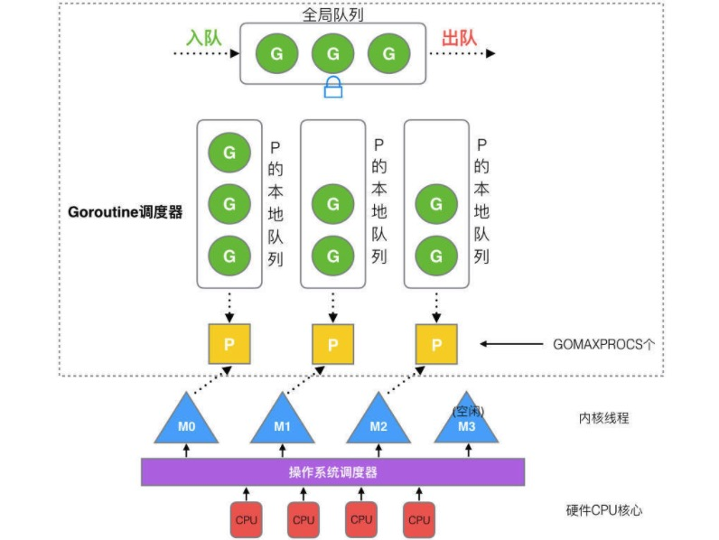
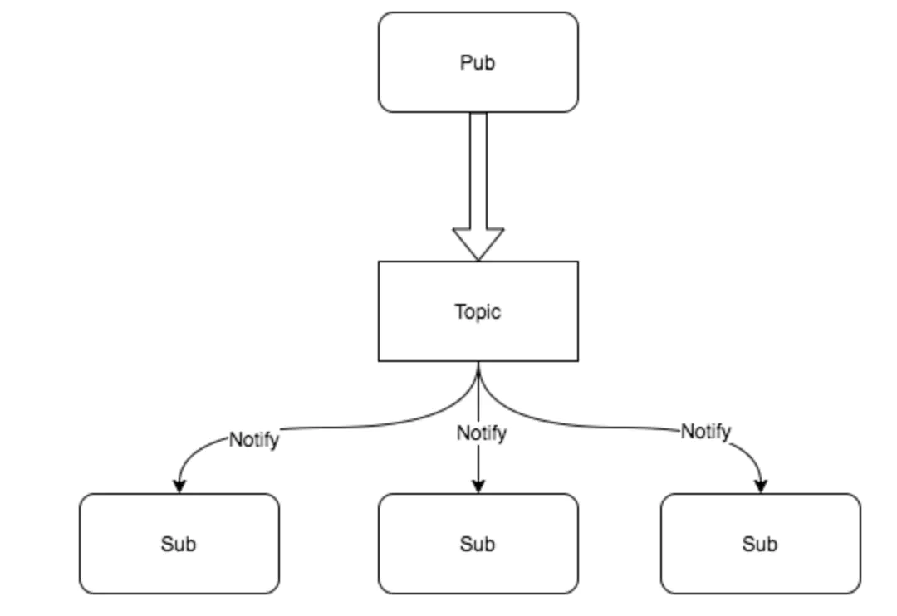

# 作业

## 思考？ 如何参考最新版的调度器实现一个新版本

参考[workpool模型](./channel/work_pool.go), 通过添加本地队列改进work pool性能

需要考虑的点:
+ 本地队列 / 全局队列
+ 调度(添加任务的时候，直接调度)

## 基于channel实现一种发布订阅模型

pub/sub 也就是发布订阅模型, 在这个模型中，消息生产者成为发布者（publisher），而消息消费者则成为订阅者（subscriber），生产者和消费者是M:N的关系。在传统生产者和消费者模型中，是将消息发送到一个队列中，而发布订阅模型则是将消息发布给一个主题

代码参考[CSP并发设计模式](./csp-model.md)中Pub/Sub 模式部分 

